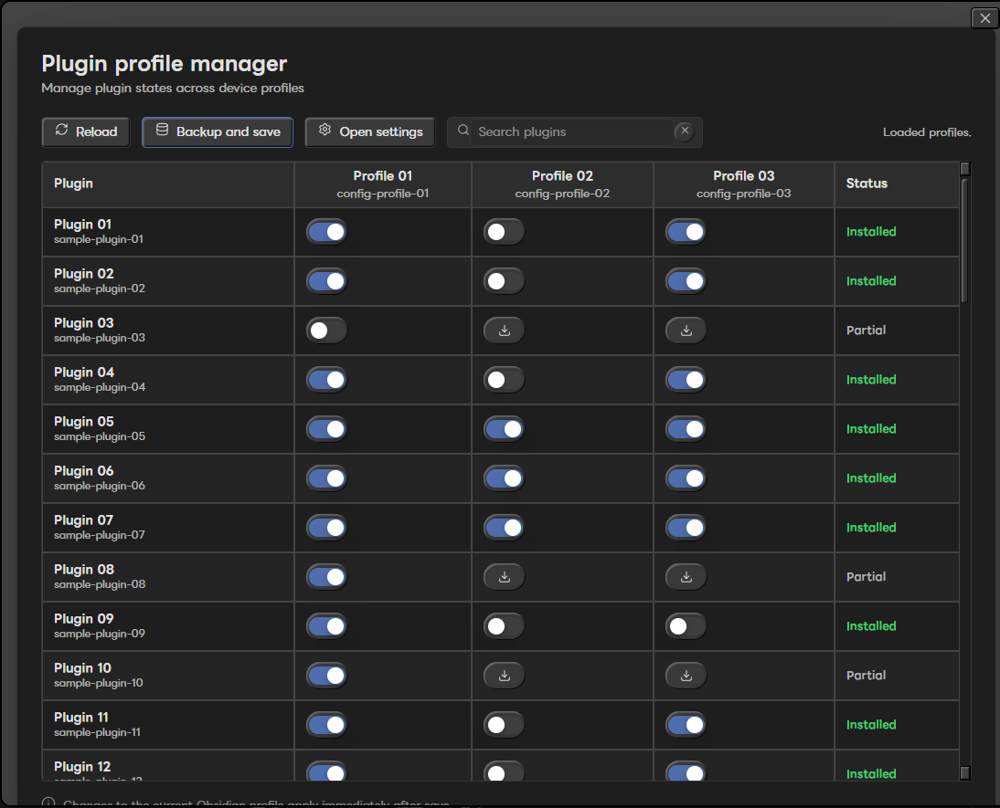

# Plugin Profile Manager

Plugin Profile Manager is an Obsidian desktop plugin for comparing and editing enabled community plugins across multiple configuration profiles.

It is designed for vaults that use separate Obsidian configuration folders for different devices or workflows.



## Features

- Register multiple Obsidian configuration folders.
- Compare community plugin state across profiles.
- Show each plugin as on, off, not installed, or blocked by invalid JSON.
- Toggle enabled plugins by editing each profile's `community-plugins.json`.
- Copy a missing plugin folder from another registered profile.
- Uninstall a plugin from one profile after creating a backup.
- Keep Plugin Profile Manager protected from accidental removal.
- Use privacy mode for screenshots, demos, and issue reports.

## What this plugin changes

Plugin Profile Manager reads plugin manifests from registered profile folders and writes to each profile's `community-plugins.json` when you save changes.

It can also copy or remove plugin folders inside registered profile folders when you explicitly use install or uninstall actions.

## What this plugin does not do

- It does not install plugins from the official Community Plugins browser.
- It does not automatically restore backups yet.
- It does not sync settings between devices by itself.
- It does not support mobile Obsidian.

Automatic backup restore is planned for a future release.

## Safety

Before saving changes, the plugin creates backups under:

```text
data/backups/community-plugins/
data/backups/plugin-uninstall/
```

If a profile's `community-plugins.json` is invalid, saving is blocked for safety.

Changes to the currently running profile are applied immediately after saving when possible. Other profiles may require restarting Obsidian on that device.

## Privacy mode

Privacy mode replaces plugin names, plugin identifiers, profile names, and profile folder labels with generic labels.

While privacy mode is on, actions that would edit, install, uninstall, or save plugin profile changes do nothing. This makes it safer to take screenshots, record demos, or attach issue reports without exposing your real plugin list.

Privacy mode is not a security boundary. It is a screenshot and demo helper.

## Usage

1. Open the command palette.
2. Run `Plugin Profile Manager: Open manager`.
3. Open settings and register the configuration folders you want to manage.
4. Review each plugin row and profile column.
5. Use `Backup and save` to write changes.

## Desktop only

Plugin Profile Manager is marked as desktop-only because it manages local Obsidian configuration folders and plugin directories from a desktop vault.

Mobile Obsidian is not supported.

## Support

Bug reports and feature requests are welcome through GitHub Issues. Support is best effort.

Pull requests are welcome, but please open an issue first for larger changes.

When sharing screenshots, enable privacy mode first.

## Development

```powershell
npm install
npm run lint
npm run build
```

## Release assets

GitHub releases should attach:

- `main.js`
- `manifest.json`
- `styles.css`

The release workflow builds these files automatically when a version tag such as `1.0.0` is pushed.
